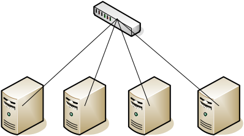

# Cluster_RDMA
A tool for test the rdma performance in a cluster.

# 1. Introduction
This tool can run on all nodes in a cluster. The running mode can be client/server mode or all-to-all mode. Each node sends M Byte data in N batch to X QPs. The tool current supports read/write operation and is mainly used to measure the throughput and latency of rdma in a cluster. 

# 2. Cluster Model


# 3. Parameter Setting
- p : tcp port listened by the program (default 19875). The socket is used to exchange meta information for  QP and registered memory, and synchronization among all nodes.
- s : server or client which the node acts as (default client). For synchronization among all nodes in both all-to-all mode and client/server mode, at least one node need act as a client or server. Otherwise deadlock will occur due to each node waiting for synchronization response from other nodes.
- f : path of the ip address file. For communication in cluster, each node will establish connection with some nodes. The ip address of these nodes must be specified in the file and separated by '\n'. The program will resolve these ip and connect to these ip with tcp port specified by 'p'.
- q : number of QP connected to each node (default 1). Each node will establish q QPs to other nodes specified by ip address (see '-f').
- c : cluster size (default 2). All-to-all communication needs this parameter. In current version, each node must finish establishing q * c QPs in cluster. Then the node begins to send data on these QPs. 
- d : the name of RDMA device (default mlx5_0). 
- i : the ib port of RDMA device (default 1).
- m : the size of registered memory (must assign a value). The whole registered memory can be used to read/write data to/from other nodes.
- o : the buffer size of each initiated WR referred (must assign a value). Noting that 'o' must not be greater than 'm'. Because the start address of the buffer is selected randomly from the address space of the registered memory.
- b : the batch size of WRs posted by one thread in each circle (default 1).
- w : wether to perform 1000 circles warmup before starting test (default no). Enable this process by '-w' without parameter value.
- I : the number of iteration performed in test (default 1000).
- r : enable this parameter to run test infinitely.
- v : enable this parameter to output the performance log into automatically named file.
- t : the value of traffic class (default 0). Before configuring this parameter, priority queues and DSCP mapping must be configured on RDMA device by ***mlnx_qos***. This parameter can be used for testing QoS performance of RDMA device.
- g : the gid index used by each QP. This parameter decides the RoCE protocol version (v1 or v2) used by each QP. Check the version using ***show_gids***.
- T : the number of test circles on q * c QPs. In current version, program will randomly select one QP and initiate b (batch) WRs to this QP in each test circle. When the all test circles are done, one iteration is done.
- W : the during of time to wait for all nodes in a cluster to start (default 1 second) before connecting to other nodes.
- e : wether to use event-triggered polling CQ or busy-polling CQ (default busy-polling). Enable this parameter to use event-triggered polling CQ.

# Example

In a cluster of 4 nodes, running an all-to-all write test will take this usage:
```shell
./hello -p 8888 -m 65536 -o 64 -b 5 -t 0 -g 1 -v -I 100 -d mlx4_1 -i 1 -w -c 3 -f ip_config -T 1000 -q 64
```
Each node will listen at tcp port 8888, select the mlx4_1 as the device and use ib port 1, register 64KB memory. Each node will establish (3 * 64) to other 3 nodes specified in the ip_config file. Each time one node initiates 5 WRs referring to random 64B data on 64KB memory to one of 192(3*64) QPs. The traffic class is set to 0 and gid index to 1 for RoCEv2 in my environment. The test circle is 1000 and iteration is 100. Warmup is enabled.
